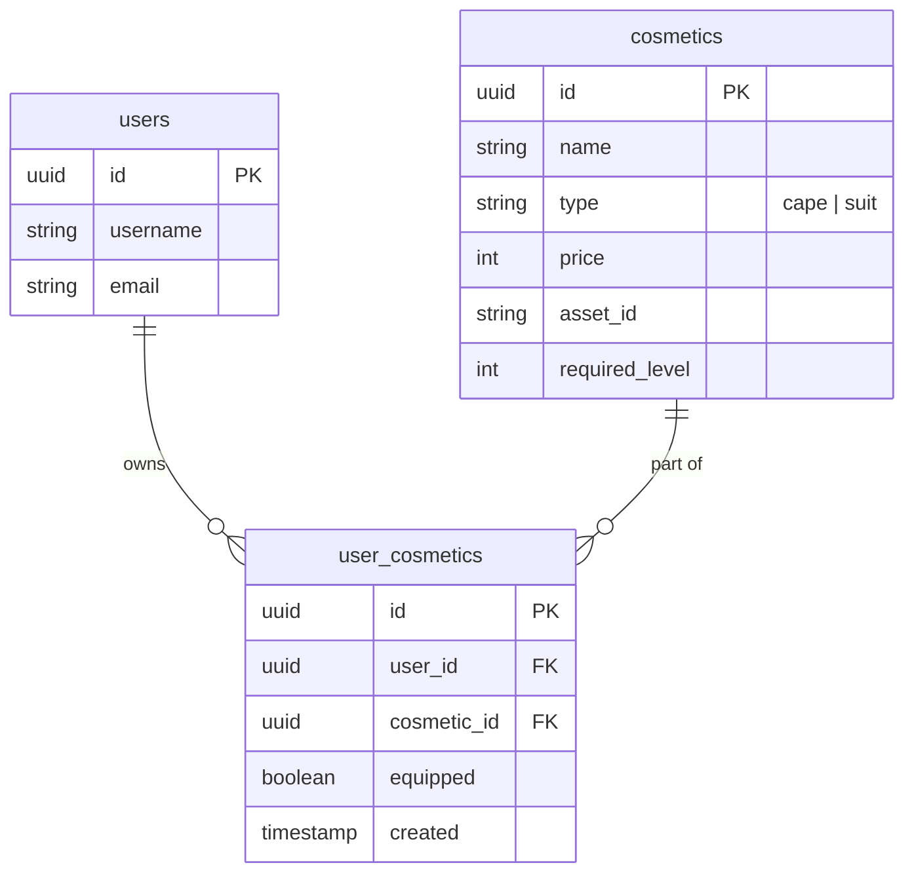

# Game Design Proposal: *El Coliseo de los Números*

This document outlines the proposed game mechanics, story, monetization strategy, database schema, and mobile UI flows for the **Mathematador** game expansion. 

---

## 📖 1. The Story & Setting
In a world inspired by the theatrical showmanship of Spanish bullfighting, mathematics is not a classroom chore—it is the ultimate sport of bravery, rhythm, and prestige.

*   **The Player**: A rookie Torero entering the grand *Plaza de Aritmética*.
*   **The Threat**: **Toros Numéricos** (Numerical Bulls). These are magical mathematical elementals—abstract beasts constructed purely from charging equations, neon arithmetic energy, and logic puzzles. No realistic animals are depicted, and they dissolve harmlessly back into numbers when tamed.
*   **The Passes (*Pases Matemáticos*)**: Instead of physical weapons, players tame these numerical elementals using mathematical passes... corresponding to the four core operations:
    *   **Addition** (*Pase de Castigo*) – Steady defensive passes.
    *   **Subtraction** (*El Recorte*) – Dodging incoming values quickly.
    *   **Multiplication** (*La Chicuelina*) – A spinning, high-prestige pass.
    *   **Division** (*El Derechazo*) – The ultimate finishing maneuver.

---

## ⚡ 2. The "Catch" (Engagement & Monetization)
Mathematador drives user engagement and monetization through **Adrenaline, Rhythm, and Prestige**.

### A. The Showmanship Meter (¡Ole! Combo)
*   **Speed is Rewarded**: Answering equations in rapid succession increases a multiplier meter.
*   **¡Ole! Sound FX**: Achieving a streak triggers an audible **"¡Ole!"** from the crowd, making correct answers feel incredibly satisfying.
*   **Crowd Rewards**: High combo streaks cause the crowd to throw flowers and gold coins (*Pesetas*) into the arena, doubling or tripling the coin reward for that question.

### B. The Toro Charge (Adrenaline)
*   A visual timer shows the Toro getting closer to the screen. If the timer runs out, the Toro charges, causing the player to lose one "Allowed Mistake" (life). This adds real performance pressure.

### C. Cosmetics Shop (Monetization & Loop)
Earned coins are used to buy and equip cosmetics in the shop:
*   **Muletas (Capes)**: Capes featuring dynamic animations (e.g., a spinning Fibonacci spiral, a matrix rain, or a fiery golden pi symbol).
*   **Trajes de Luces (Suits of Lights)**: Torero suits with glowing, matrix-like equation patterns.
*   **Flares**: Custom entry animations and music when starting a challenge.

---

## 🎮 3. Game Mode: *La Gran Corrida* (Endless Gauntlet)
This is an intense, endless survival mode where players test their limits and compete on weekly leaderboards.

### Mechanics:
*   **Mixed Operations**: Equations are generated randomly, mixing addition, subtraction, multiplication, and division.
*   **Increased Difficulty**:
    *   **Timer**: Reduced from 60 seconds to 45 seconds per wave.
    *   **Allowed Mistakes**: Reduced from 3 to 2.
*   **Wave Progression**: Every 5 waves, the speed of the timer increases, and equations grow in length and complexity (e.g., moving from single-digit to double-digit operators).
*   **High Rewards**: Successful waves yield higher XP (35) and Coins (25).
*   **High Scores & Leaderboards**: Weekly global leaderboards track the highest wave reached, awarding top players exclusive cosmetics or badges.

---

## 💾 4. Proposed Database Schema
To support the cosmetics shop and purchase tracking, we propose the following schema additions.

### Dynamic Balance Calculation
To prevent synchronization issues and transaction errors, the user's available balance is calculated dynamically:
$$\text{Current Coin Balance} = \text{Total Earned Coins (from completed challenges)} - \text{Total Spent Coins (prices of purchased cosmetics)}$$

---

## 📱 5. Proposed Mobile UI/UX Flow
We propose adding two new screens to the React Native/Expo app:

### Screen A: *Tienda de Torero* (Cosmetics Store)
*   **Header**: Displays current coin balance and player level.
*   **Tabs**: "Capes" and "Suits".
*   **Item Cards**:
    *   Shows item name, visual preview, and price.
    *   **Purchase Button**: Active if player has enough coins and meets level requirements (e.g., "Requires Level 3").
    *   **Equip Button**: Becomes active once purchased. Equipping an item marks it as active and automatically un-equips any other active items of that type.

### Screen B: *La Gran Corrida* (Gauntlet Portal)
*   **Statistics**: Displays player's personal high score (highest wave reached) and weekly leaderboard rank.
*   **Equipped Loadout**: Displays the player's current Torero avatar wearing their equipped Cape and Suit.
*   **Start Button**: Launches the Gauntlet game screen with the custom 45-second timer, mixed operations generator, and 2-mistake limit.

---

## 🛡️ 6. Theme Risk Mitigation & Universal Appeal
While the dramatic showmanship of bullfighting provides an exciting aesthetic wrapper, the associated animal cruelty represents a potential risk for international audiences. To ensure universal appeal, the game positions its theme carefully:

*   **Constructs over Creatures**: The Toros are clearly depicted as non-organic, magical elementals built of glowing numbers and matrix-like math code.
*   **Taming, Not Harming**: There are no swords, blood, or physical violence. The core mechanic is "taming" or "solving" the equation to bring the elemental to rest.
*   **Alternative Aesthetic Skin Sets**:
    *   *Mechanical Bulls*: Futuristic steampunk or retro arcade robotic bulls.
    *   *Abstract Math Beasts*: Polyhedral shapes and fractals that morph into bull-like silhouettes.
    *   *Stone Golems*: Ancient monuments carved with roman numerals.
