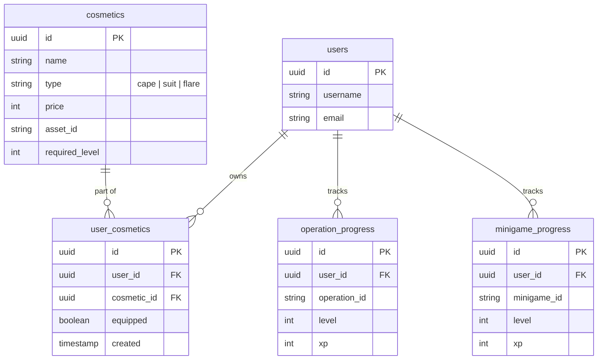

# Game Design Proposal: *El Coliseo de los Números*

This document outlines the game mechanics, story, database schema, and mobile UI flows for the **Mathematador** game expansion.

> **Implementation status (updated 2026-08-27):** everything described below shipped across issues [#15](https://github.com/webstartapp/mathematador/issues/15)/[#16](https://github.com/webstartapp/mathematador/issues/16)/[#17](https://github.com/webstartapp/mathematador/issues/17)/[#18](https://github.com/webstartapp/mathematador/issues/18) and their merged PRs (#19, #22, #24) — Toro Hint/Focus/Inspiration, the Combo Meter, the Gauntlet, the Daily Challenge, and the Cosmetics Shop are all implemented and playable. Status notes are inlined below where a detail changed during implementation or a piece stayed a mock. See the root [`CLAUDE.md`](../CLAUDE.md) for the technical map, including gameplay bugs found after this doc was written (most notably: the Gauntlet and Daily Challenge currently fail to render at all due to an unrelated id-mismatch bug — the design and backend logic described here are intact, only the frontend minigame lookup is broken).

---

## 📖 1. The Story & Setting
In a world inspired by the theatrical showmanship and rhythm of Spanish performances, mathematics is a grand dance of harmony, speed, and prestige. This is a family-friendly (0+) game with zero violence, conflict, or harm.

*   **The Player**: A rookie Mathematador entering the grand *Plaza de Aritmética*.
*   **The Partner**: The **Toro Numérico** (Numerical Bull) is your loyal, majestic companion, not an enemy. You and your Toro work together as a team to choreograph the numbers.

    

*   **The Challenge**: Chaotic, unstructured numbers and equations drift into the arena.
*   **The Passes (*Pases Matemáticos*)**: The Mathematador uses elegant cape passes to direct, structure, and solve the equations, creating a beautiful flow of numbers.
    *   **Addition** (*Pase de Armonía*) – Blending numbers together smoothly.
    *   **Subtraction** (*El Recorte*) – Splitting numbers with quick, graceful dodges.
    *   **Multiplication** (*La Chicuelina*) – A spinning, high-prestige combination.
    *   **Division** (*El Derechazo*) – A clean, elegant resolution.

---

## ⚡ 2. The "Catch" (Engagement & Monetization)
Mathematador drives user engagement and monetization through **Adrenaline, Rhythm, and Prestige**.

### A. The Showmanship Meter (¡Ole! Combo)
*   **Speed is Rewarded**: Answering equations in rapid succession increases a multiplier meter.
*   **¡Ole! Sound FX**: Achieving a streak triggers an audible **"¡Ole!"** from the crowd, making correct answers feel incredibly satisfying.
*   **Crowd Rewards**: High combo streaks cause the crowd to throw flowers and gold coins (*Pesetas*) into the arena, doubling or tripling the coin reward for that question.

    > ✅ **Implemented** as the Combo Streak Meter (`mathematador-app/src/components/toro/`). Milestones fire at streaks of 3, 5, 8, then every 5 thereafter — each shows an animated "¡Ole!" popup with a synthesized fanfare (`useOleSound.ts`), and streaks of 8+ trigger a flowers/coin-rain particle burst (`ComboRewardBurst.tsx`). Inspired answers (see Toro Inspiration below) proportionally boost the coin payout, not a flat "double or triple."

### B. The Toro Charge (Adrenaline)
*   A visual timer shows the Toro getting closer to the screen. If the timer runs out, the Toro charges, causing the player to lose one "Allowed Mistake" (life). This adds real performance pressure.

    > 🚧 **Partially implemented**: the countdown timer and "Time's Up!" alert exist (`ChallengeGameScreen.tsx`), but there's no visual Toro-approaching animation — the pressure cue today is just the numeric timer (turning red under 10s). Running out of time currently exits to Home rather than costing an "Allowed Mistake." Note `Alert.alert` is a no-op on the Expo web build (see root `CLAUDE.md`).

### C. Toro Cooperation Mechanics (Partnership Gameplay)
The Toro Numérico is not just a passive visual companion—it is an active partner that supports you during the performance:

*   **Toro Hint (Meter-Based Assist)**: As you submit correct answers, a **Cooperation Meter** fills up. When full, the Toro displays a helpful mental breakdown for complex questions (e.g., for `12 × 8`, it shows the suggestion `10 × 8 + 2 × 8`).

    > ✅ **Implemented** (`ToroPanel` in `ChallengeGameScreen.tsx`, breakdown logic in `helpers/getToroHint.ts`). The cooperation meter fills +25% per correct answer (4 in a row unlocks a hint) and resets on use. The hint resolves the actual operation from each exercise's separator rather than the challenge's overall mode, so it also works correctly in the mixed-operation Gauntlet/Daily modes.

*   **Toro Focus (Timer Freeze)**: Once per wave, the player can trigger their partner's focus, freezing the countdown timer for 3 seconds to let them compose their thoughts.

    > ✅ **Implemented** exactly as described — one use per challenge, 3-second freeze.

*   **Toro Inspiration (XP Boost)**: Maintaining a high combo streak inspires your Toro. While inspired, your Toro glows with energy, making the next correct answer worth **2x XP**.

    > ✅ **Implemented**, though not literally "2x" — a streak of 3+ correct answers marks each further correct answer as "inspired," and each inspired answer adds a proportional XP bonus (and, as of the same change, a matching coin bonus) computed identically client- and server-side. The panel border glows gold and shows an "Inspired (2x XP)" badge while active.

### D. Cosmetics Shop (Monetization & Loop)
Earned coins are used to buy and equip cosmetics in the shop:
*   **Muletas (Capes)**: Capes featuring dynamic animations (e.g., a spinning Fibonacci spiral, a matrix rain, or a fiery golden pi symbol).
*   **Trajes de Luces (Suits of Lights)**: Torero suits with glowing, matrix-like equation patterns.
*   **Flares**: Custom entry animations and music when starting a challenge.

> ✅ **Implemented** as *Tienda de Torero* (`TiendaScreen.tsx`). Currently seeded with 4 items (2 capes, 2 suits — see §4); no `flare`-type items are seeded yet even though the schema and UI both support the type. The shop purchase/equip loop is real; equipped items show in a static loadout preview on the Gauntlet screen, but capes/suits don't yet render as the described dynamic in-game animations (spinning Fibonacci spiral, matrix rain, etc.) on the challenge screen itself — today they're a name/price/level-gate with no equipped-state effect on gameplay visuals.

---

## 🎮 3. Arena Game Modes

Mathematador features two high-stakes arena game modes under the *Coliseo de los Números* expansion:

### A. *La Gran Corrida* (Endless Gauntlet)
This is an intense, endless survival mode where players test their limits and compete on weekly leaderboards.
*   **Mixed Operations**: Equations are generated randomly, mixing addition, subtraction, multiplication, and division.
*   **Increased Difficulty**:
    *   **Timer**: Reduced from 60 seconds to 45 seconds per wave.
    *   **Allowed Mistakes**: Reduced from 3 to 2.
*   **Wave Progression**: Every 5 waves, the speed of the timer increases, and equations grow in length and complexity (e.g., moving from single-digit to double-digit operators).
*   **High Rewards**: Successful waves yield higher XP (35) and Coins (25).
*   **High Scores & Leaderboards**: Weekly global leaderboards track the highest wave reached, awarding top players exclusive cosmetics or badges.

    > ✅ **Implemented** (`GauntletScreen.tsx`, `operationId: "gauntlet"`, `server/src/utils/challengeConfig.ts`) — the 45s timer, 2-mistake limit, and 35 XP / 25 coin rewards match exactly. ⚠️ **Currently broken**: starting a Gauntlet run always fails to render the minigame due to an unrelated id-mismatch bug (see root `CLAUDE.md`). 📋 **Not implemented**: wave-by-wave progressive difficulty scaling (every 5 waves) and weekly leaderboards — the leaderboard shown today is a hardcoded, non-functional UI mock (it was only ever scoped as a mock in the originating issue), not backed by any ranking data.

### B. *La Corrida Diaria* (Daily Challenge)
A single, fixed-preset challenge generated every calendar day to drive daily user retention.
*   **Daily Presets**: Every player globally receives the exact same set of equations for that day.
*   **High-Stakes Rules**:
    *   **Timer**: 90 seconds.
    *   **Allowed Mistakes**: 0 (1 life total). A single mistake ends the run.
    *   **Target**: Solve exactly 20 equations.
*   **Unique Rewards**:
    *   Completing the challenge awards a massive bonus of **50 coins**.
    *   A small percentage chance (e.g., 5%) to drop an exclusive, daily-themed cosmetic item (e.g., a special Cape or Suit) that cannot be bought in the shop.
*   **Daily Leaderboards**: Tracks execution speed for all players who successfully complete the daily challenge.

    > ✅ **Implemented** (`operationId: "daily_challenge"`, seeded by the calendar date so every player gets the same equations). The numbers match exactly: 90s timer, 0 allowed mistakes, 20 equations, 50-coin completion bonus, 5% cosmetic-drop chance (`server/src/utils/progressHelpers.ts`'s `handleCosmeticDrop`). ⚠️ Same rendering bug as the Gauntlet applies here too. 📋 **Not implemented**: the daily speed leaderboard — no ranking data or endpoint exists for it.

---

## 💾 4. Database Schema

> ✅ **Implemented as designed** — see `server/src/migrations/20260615204201_cosmetics_and_progression.js`. The only structural addition beyond this diagram is a `cosmetic_type` column on `user_cosmetics` (denormalized copy of the cosmetic's type, so the "one equipped item per type" constraint below can be enforced with a database-level partial unique index without a join). Seed data ships 4 cosmetics (2 capes, 2 suits) — no `flare`-type items exist yet despite the type being supported end-to-end.

To support the cosmetics shop, purchase tracking, and multi-dimensional progression, this is the schema used.

### Dynamic Balance Calculation
To prevent synchronization issues and transaction errors, the user's available balance is calculated dynamically:
$$\text{Current Coin Balance} = \text{Total Earned Coins (from completed challenges)} - \text{Total Spent Coins (prices of purchased cosmetics)}$$

> [!NOTE]
> While dynamic calculation guarantees that a user's balance is always derived directly from their audit history, concurrent double-spend attacks or race conditions are prevented during API purchase execution by executing the balance check and purchase entry inside a database transaction (`SERIALIZABLE` isolation or explicit row locks). Additionally, a unique constraint on `(user_id, cosmetic_id)` in the `user_cosmetics` table ensures that a cosmetic item can never be purchased twice by the same user.

---

## 📱 5. Mobile UI/UX Flow

> ✅ **Implemented** — both screens below shipped as `TiendaScreen.tsx` and `GauntletScreen.tsx`, registered as the `Tienda` and `Gauntlet` routes.

### Screen A: *Tienda de Torero* (Cosmetics Store)

*   **Header**: Displays current coin balance and player level.
*   **Tabs**: "Capes" and "Suits".
*   **Item Cards**:
    *   Shows item name, visual preview, and price.
    *   **Purchase Button**: Active if player has enough coins and meets level requirements (e.g., "Requires Level 3").
    *   **Equip Button**: Becomes active once purchased. Equipping an item marks it as active and automatically un-equips any other active items of that type.

### Screen B: *La Gran Corrida* (Gauntlet Portal)
*   **Statistics**: Displays player's personal high score (highest wave reached) and weekly leaderboard rank.
*   **Equipped Loadout**: Displays the player's current Torero avatar wearing their equipped Cape and Suit.
*   **Start Button**: Launches the Gauntlet game screen with the custom 45-second timer, mixed operations generator, and 2-mistake limit.

    > This screen also doubles as the entry point for the Daily Challenge card, not just the Gauntlet. Personal stats and the equipped-loadout preview are real; the "weekly leaderboard rank" is part of the hardcoded mock (see §3A) and doesn't reflect a real rank.

---

## 🛡️ Theme & 0+ Rating Alignment
To ensure a universally appealing, family-friendly (0+) rating, the game completely separates itself from the violent aspects of traditional bullfighting:

*   **No Harm or Conflict**: The Toro Numérico is your friendly partner and co-performer. There are no weapons, no physical contact, and no harm.
*   **The "Fight" is Against the Math**: As a traditional torero dances with a bull, the Mathematador dances with numbers. The equations are the elements to be solved and structured.
*   **Resolution, Not Dissolution**: Solving an equation completes a beautiful pattern, causing the numbers to turn into sparkles of light that feed the crowd's excitement.
*   **Friendly Companions**: Capes and suits are cosmetic items for performance flair (flashing lights, color changes, and sparks).
