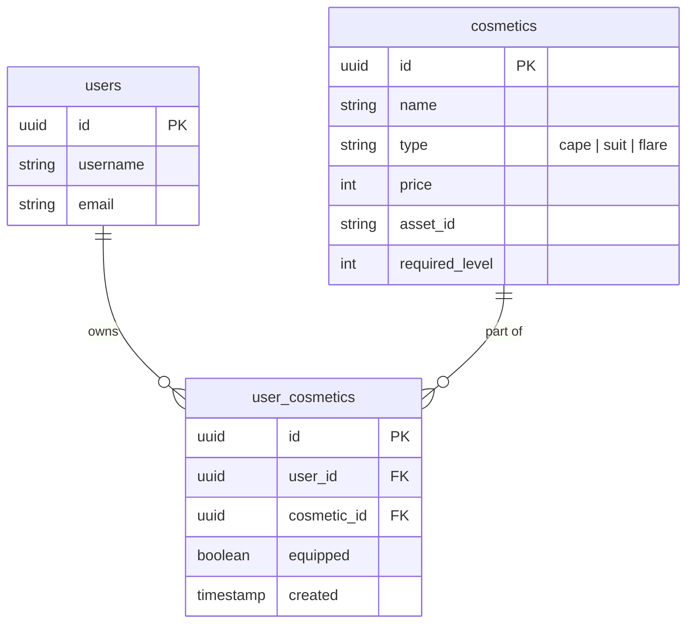
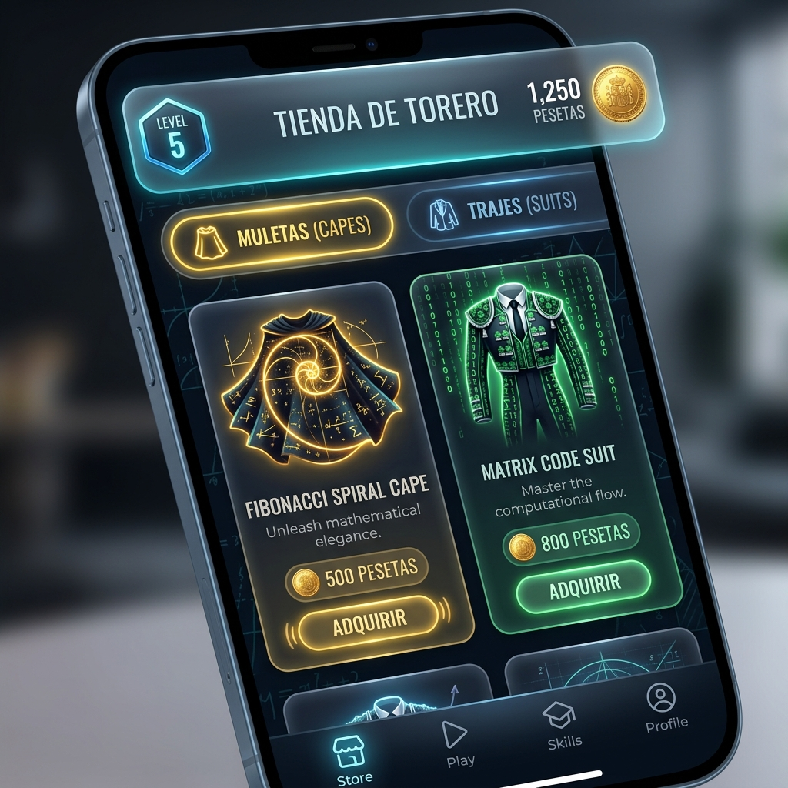

# Game Design Proposal: *El Coliseo de los Números*

This document outlines the proposed game mechanics, story, monetization strategy, database schema, and mobile UI flows for the **Mathematador** game expansion. 

---

## 📖 1. The Story & Setting
In a world inspired by the theatrical showmanship and rhythm of Spanish performances, mathematics is a grand dance of harmony, speed, and prestige. This is a family-friendly (0+) game with zero violence, conflict, or harm.

*   **The Player**: A rookie Mathematador entering the grand *Plaza de Aritmética*.
*   **The Partner**: The **Toro Numérico** (Numerical Bull) is your loyal, majestic companion, not an enemy. You and your Toro work together as a team to choreograph the numbers.

    

*   **The Challenge**: Chaotic, unstructured numbers and equations drift into the arena.
*   **The Passes (*Pases Matemáticos*)**: The Mathematador uses elegant cape passes to direct, structure, and solve the equations, creating a beautiful flow of numbers.
    *   **Addition** (*Pase de Armonía*) – Blending numbers together smoothly.
    *   **Subtraction** (*El Recorte*) – Splitting numbers with quick, graceful dodges.
    *   **Multiplication** (*La Chicuelina*) – A spinning, high-prestige combination.
    *   **Division** (*El Derechazo*) – A clean, elegant resolution.

---

## ⚡ 2. The "Catch" (Engagement & Monetization)
Mathematador drives user engagement and monetization through **Adrenaline, Rhythm, and Prestige**.

### A. The Showmanship Meter (¡Ole! Combo)
*   **Speed is Rewarded**: Answering equations in rapid succession increases a multiplier meter.
*   **¡Ole! Sound FX**: Achieving a streak triggers an audible **"¡Ole!"** from the crowd, making correct answers feel incredibly satisfying.
*   **Crowd Rewards**: High combo streaks cause the crowd to throw flowers and gold coins (*Pesetas*) into the arena, doubling or tripling the coin reward for that question.

### B. The Toro Charge (Adrenaline)
*   A visual timer shows the Toro getting closer to the screen. If the timer runs out, the Toro charges, causing the player to lose one "Allowed Mistake" (life). This adds real performance pressure.

### C. Toro Cooperation Mechanics (Partnership Gameplay)
The Toro Numérico is not just a passive visual companion—it is an active partner that supports you during the performance:

*   **Toro Hint (Meter-Based Assist)**: As you submit correct answers, a **Cooperation Meter** fills up. When full, the Toro displays a helpful mental breakdown for complex questions (e.g., for `12 × 8`, it shows the suggestion `10 × 8 + 2 × 8`).
*   **Toro Focus (Timer Freeze)**: Once per wave, the player can trigger their partner's focus, freezing the countdown timer for 3 seconds to let them compose their thoughts.
*   **Toro Inspiration (XP Boost)**: Maintaining a high combo streak inspires your Toro. While inspired, your Toro glows with energy, making the next correct answer worth **2x XP**.

### D. Cosmetics Shop (Monetization & Loop)
Earned coins are used to buy and equip cosmetics in the shop:
*   **Muletas (Capes)**: Capes featuring dynamic animations (e.g., a spinning Fibonacci spiral, a matrix rain, or a fiery golden pi symbol).
*   **Trajes de Luces (Suits of Lights)**: Torero suits with glowing, matrix-like equation patterns.
*   **Flares**: Custom entry animations and music when starting a challenge.

---

## 🎮 3. Game Mode: *La Gran Corrida* (Endless Gauntlet)
This is an intense, endless survival mode where players test their limits and compete on weekly leaderboards.

### Mechanics:
*   **Mixed Operations**: Equations are generated randomly, mixing addition, subtraction, multiplication, and division.
*   **Increased Difficulty**:
    *   **Timer**: Reduced from 60 seconds to 45 seconds per wave.
    *   **Allowed Mistakes**: Reduced from 3 to 2.
*   **Wave Progression**: Every 5 waves, the speed of the timer increases, and equations grow in length and complexity (e.g., moving from single-digit to double-digit operators).
*   **High Rewards**: Successful waves yield higher XP (35) and Coins (25).
*   **High Scores & Leaderboards**: Weekly global leaderboards track the highest wave reached, awarding top players exclusive cosmetics or badges.

---

## 💾 4. Proposed Database Schema
To support the cosmetics shop and purchase tracking, we propose the following schema additions.

### Dynamic Balance Calculation
To prevent synchronization issues and transaction errors, the user's available balance is calculated dynamically:
$$\text{Current Coin Balance} = \text{Total Earned Coins (from completed challenges)} - \text{Total Spent Coins (prices of purchased cosmetics)}$$

> [!NOTE]
> While dynamic calculation guarantees that a user's balance is always derived directly from their audit history, concurrent double-spend attacks or race conditions are prevented during API purchase execution by executing the balance check and purchase entry inside a database transaction (`SERIALIZABLE` isolation or explicit row locks). Additionally, a unique constraint on `(user_id, cosmetic_id)` in the `user_cosmetics` table ensures that a cosmetic item can never be purchased twice by the same user.

---

## 📱 5. Proposed Mobile UI/UX Flow
We propose adding two new screens to the React Native/Expo app:

### Screen A: *Tienda de Torero* (Cosmetics Store)

*   **Header**: Displays current coin balance and player level.
*   **Tabs**: "Capes" and "Suits".
*   **Item Cards**:
    *   Shows item name, visual preview, and price.
    *   **Purchase Button**: Active if player has enough coins and meets level requirements (e.g., "Requires Level 3").
    *   **Equip Button**: Becomes active once purchased. Equipping an item marks it as active and automatically un-equips any other active items of that type.

### Screen B: *La Gran Corrida* (Gauntlet Portal)
*   **Statistics**: Displays player's personal high score (highest wave reached) and weekly leaderboard rank.
*   **Equipped Loadout**: Displays the player's current Torero avatar wearing their equipped Cape and Suit.
*   **Start Button**: Launches the Gauntlet game screen with the custom 45-second timer, mixed operations generator, and 2-mistake limit.

---

## 🛡️ Theme & 0+ Rating Alignment
To ensure a universally appealing, family-friendly (0+) rating, the game completely separates itself from the violent aspects of traditional bullfighting:

*   **No Harm or Conflict**: The Toro Numérico is your friendly partner and co-performer. There are no weapons, no physical contact, and no harm.
*   **The "Fight" is Against the Math**: As a traditional torero dances with a bull, the Mathematador dances with numbers. The equations are the elements to be solved and structured.
*   **Resolution, Not Dissolution**: Solving an equation completes a beautiful pattern, causing the numbers to turn into sparkles of light that feed the crowd's excitement.
*   **Friendly Companions**: Capes and suits are cosmetic items for performance flair (flashing lights, color changes, and sparks).
