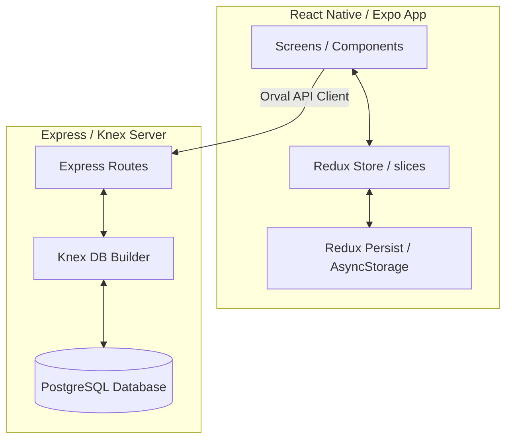
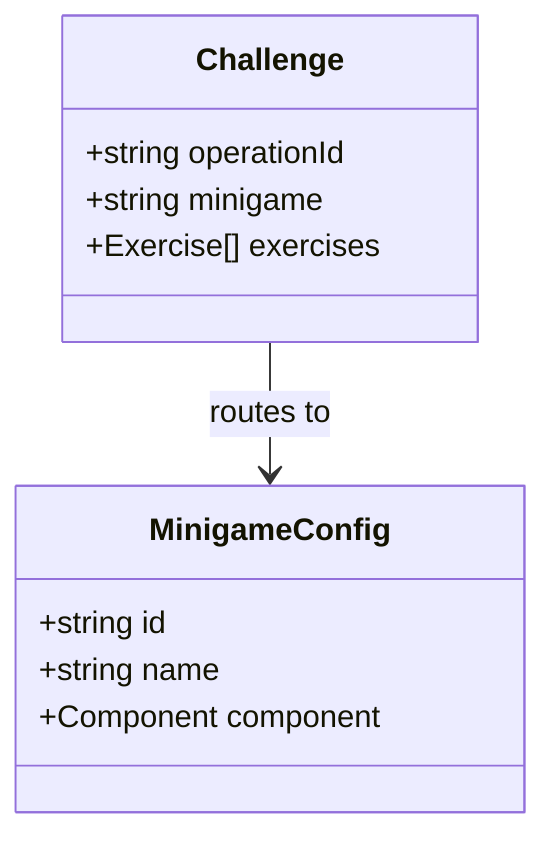

# Game Structure: *Mathematador*

This document outlines the architecture, game modes, and minigame types in **Mathematador**, describing how the current system is designed and how new modes integrate with it.

---

## 🏗️ 1. Architecture Overview

Mathematador is built as a TypeScript monorepo with an offline-first mobile client and a synchronization backend:

1. **Frontend App (`mathematador-app/`)**:
   - Built on React Native and Expo.
   - Uses **Redux Toolkit** for local state and **Redux Persist** (with AsyncStorage) for offline-first gameplay persistence.
   - Integrates with the backend using an **Orval-generated client** (`_generated/api.ts`).
2. **Backend Server (`server/`)**:
   - Express server with TypeScript.
   - Uses **Knex.js** for migrations, seeding, and database queries (targeting PostgreSQL/SQLite).

---

## 🎮 2. Game Modes

### A. Standard Mode (Operation Challenges)
*   **Description**: Players practice and level up in individual arithmetic operations: Addition, Subtraction, Multiplication, and Division.
*   **Structure**:
    - Each operation has its own level and XP track stored in `operation_progress`.
    - Starting a challenge generates a session with **10 exercises** scaling in size and complexity according to the player's level.
    - Default settings: 60-second limit, 3 allowed mistakes.
    - Completing a challenge rewards XP and Coins, and unlocks the next challenge level.

### B. *La Gran Corrida* (Endless Gauntlet) – *NEW*
*   **Description**: An intense, survival-based gauntlet mode designed to test speed and versatility.
*   **Structure**:
    - Operation type is `gauntlet`.
    - Automatically mixes all 4 basic operations (Addition, Subtraction, Multiplication, Division) within a single challenge session.
    - Enhanced difficulty constraints: 45-second timer limit, 2 allowed mistakes.
    - Leveling up increases formula complexity and speeds up the countdown timer.
    - High rewards: 35 XP and 25 Coins per wave.

---

## 🧩 3. Minigames (Layout Templates)

Minigames define the user interface and input mechanics used to solve the generated exercises. The system is designed to be highly modular, routing challenge sessions to their respective layout components based on the `minigame` attribute.

### Supported & Planned Minigames:

| Minigame ID | Public Name | Status | Description |
| :--- | :--- | :--- | :--- |
| **`SingleLineMinigame`** | *Mathematical Sprint* | **Implemented** | Traditional input view. The equation is displayed on screen, and the player uses a custom numeric grid keyboard to input digits. |
| **`dragAndDrop`** | *Arithmetic Drag* | *Planned (in Schema)* | Drag-and-drop tiles containing numbers or operators into empty placeholders to complete equations. |
| **`crossNumbers`** | *Cross-Math* | *Planned (in Schema)* | Fill out a crossword-like grid of interconnected equations. |
| **`memory`** | *Equation Match* | *Planned (in Schema)* | Turn cards to match expressions with their correct numerical solutions. |

---

## 📐 4. Fitting the New Features

The proposed **El Coliseo de los Números** features (Endless Gauntlet, Cosmetics Store, and Toro Assists) fit cleanly into this existing design:

1. **Gauntlet Integration**:
   - The Endless Gauntlet uses `operationId: "gauntlet"` and maps to `minigame: "SingleLineMinigame"`.
   - This allows it to reuse the existing `SingleLine` input and logic while introducing custom backend timers, mistakes limits, and mixed operator equations.
2. **Toro Assists Integration**:
   - Add the Toro companion panel as a wrapper component inside `ChallengeGameScreen.tsx`.
   - The panel captures correct/incorrect responses to fill the cooperation meter, manages the Toro Focus (timer freeze), and renders Toro Hints based on the current equation.
3. **Cosmetics & Store**:
   - Store inventory and purchases are managed via the new database tables (`cosmetics`, `user_cosmetics`).
   - The client fetches cosmetics and displays them in a dedicated navigation screen (`TiendaScreen.tsx`), updating Redux state and storing equipped items to style the game screens.
