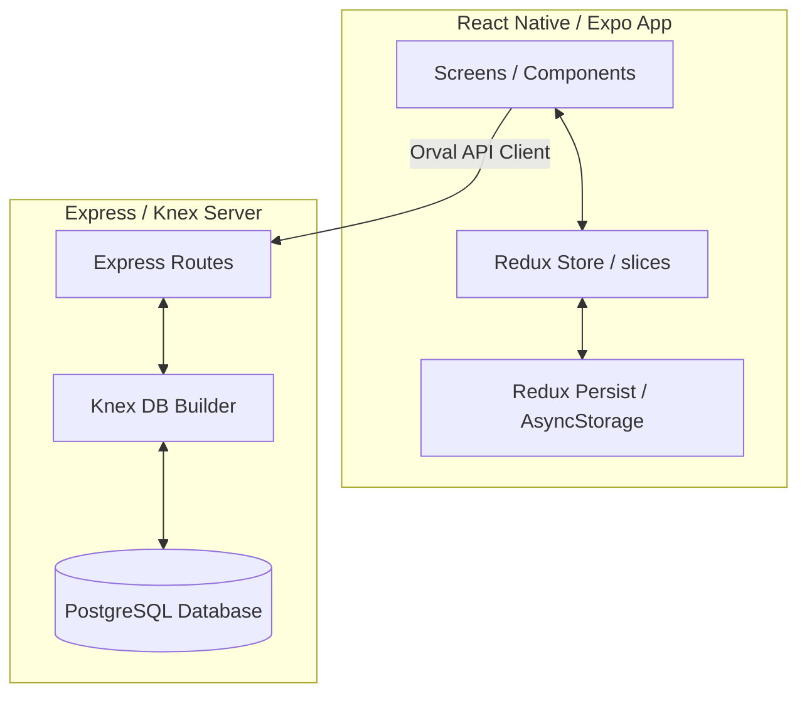
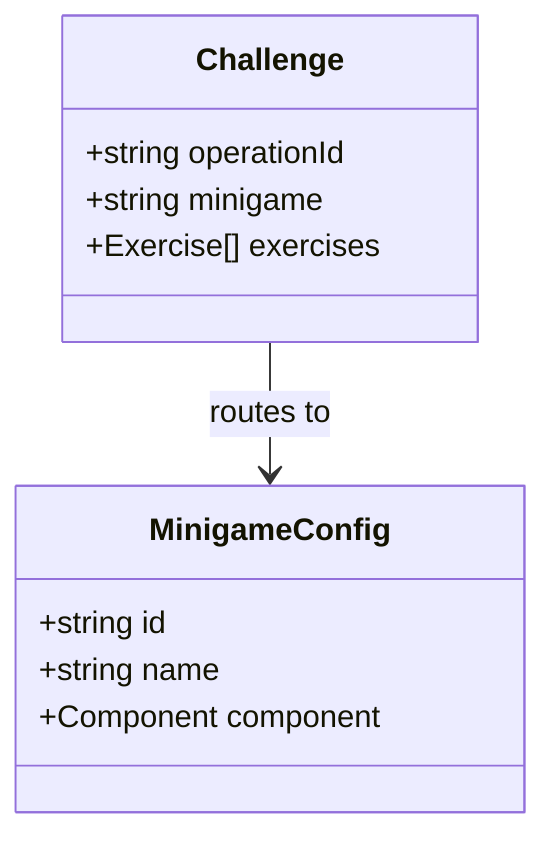

# Game Structure: *Mathematador*

This document outlines the architecture, game modes, and minigame types in **Mathematador**, describing how the current system is designed and how new modes integrate with it.

> **Implementation status (updated 2026-08-27):** this document was written as a forward-looking integration plan before Gauntlet, Daily Challenge, the Cosmetics Shop, and the Toro/combo mechanics existed. All of it has since shipped (see [`docs/game_proposal.md`](game_proposal.md) for feature-by-feature status notes) — §4 below is kept in past tense accordingly. For the current technical map (conventions, dev commands, known bugs), see the root [`CLAUDE.md`](../CLAUDE.md).

---

## 🏗️ 1. Architecture Overview

Mathematador is built as a TypeScript monorepo with an offline-first mobile client and a synchronization backend:

1. **Frontend App (`mathematador-app/`)**:
   - Built on React Native and Expo.
   - Uses **Redux Toolkit** for local state and **Redux Persist** (with AsyncStorage) for offline-first gameplay persistence.
   - Integrates with the backend using an **Orval-generated client** (`_generated/api.ts`).
2. **Backend Server (`server/`)**:
   - Express server with TypeScript.
   - Uses **Knex.js** for migrations, seeding, and database queries (targeting PostgreSQL/SQLite).

---

## 🎮 2. Game Modes

All three modes below are implemented and match this description numerically; see `docs/game_proposal.md` for feature-by-feature status callouts (mocks, known gaps) and the root `CLAUDE.md` for the bugs currently affecting them.

### A. Standard Mode (Operation Challenges)
*   **Description**: Players practice and level up in individual arithmetic operations: Addition, Subtraction, Multiplication, and Division.
*   **Structure**:
    - Each operation has its own level and XP track stored in `operation_progress`.
    - Starting a challenge generates a session with **10 exercises** scaling in size and complexity according to the player's level.
    - Default settings: 60-second limit, 3 allowed mistakes.
    - Completing a challenge rewards XP and Coins, and unlocks the next challenge level.

### B. *La Gran Corrida* (Endless Gauntlet)
*   **Description**: An intense, survival-based gauntlet mode designed to test speed and versatility.
*   **Structure**:
    - Operation type is `gauntlet`.
    - Automatically mixes all 4 basic operations (Addition, Subtraction, Multiplication, Division) within a single challenge session.
    - Enhanced difficulty constraints: 45-second timer limit, 2 allowed mistakes.
    - Leveling up increases formula complexity and speeds up the countdown timer. *(📋 Not yet implemented — no wave-progression scaling exists today; every wave uses the same base difficulty.)*
    - High rewards: 35 XP and 25 Coins per wave.
    - ⚠️ Currently broken end-to-end — see the minigame-id mismatch note in §3.

### C. *La Corrida Diaria* (Daily Challenge)
*   **Description**: A fixed-preset daily challenge with high stakes to drive engagement and retention.
*   **Structure**:
    - Operation type is `daily_challenge`.
    - 20 equations, 90-second limit, and 0 allowed mistakes (1 life).
    - Rewards a 50-coin completion bonus plus a 5% chance of exclusive daily cosmetic drops. *(📋 "Global daily leaderboards" are not implemented — no ranking data or endpoint exists.)*
    - ⚠️ Same rendering bug as the Gauntlet — see §3.

---

## 🧩 3. Minigames (Layout Templates)

Minigames define the user interface and input mechanics used to solve the generated exercises. The system is designed to be highly modular, routing challenge sessions to their respective layout components based on the `minigame` attribute.

### Supported & Planned Minigames:

| Minigame ID | Public Name | Status | Description |
| :--- | :--- | :--- | :--- |
| **`SingleLineMinigame`** | *Mathematical Sprint* | **Implemented** | Traditional input view. The equation is displayed on screen, and the player uses a custom numeric grid keyboard (drag *or* tap-to-place) to input digits. |
| **`dragAndDrop`** | *Arithmetic Drag* | *Planned (in Schema)* | Drag-and-drop tiles containing numbers or operators into empty placeholders to complete equations. |
| **`crossNumbers`** | *Cross-Math* | *Planned (in Schema)* | Fill out a crossword-like grid of interconnected equations. |
| **`memory`** | *Equation Match* | *Planned (in Schema)* | Turn cards to match expressions with their correct numerical solutions. |

> ⚠️ The frontend's minigame registry (`configs/minigames.ts`) currently spells this id `"SingleLineMinigame"`, while every other part of the system — this table's `Minigame` enum, the server, and the Gauntlet/Daily launch code — spells it `"singleLine"`. The mismatch means Gauntlet and Daily Challenge currently fail to find a minigame component at all (see root `CLAUDE.md` gotchas). Fixing it is a one-line rename, not a design change.

---

## 📐 4. How the New Features Fit In

The **El Coliseo de los Números** features (Endless Gauntlet, Cosmetics Store, and Toro Assists) shipped along the lines originally planned here:

1. **Gauntlet & Daily Challenge Integration**:
   - The Endless Gauntlet uses `operationId: "gauntlet"` and the Daily Challenge uses `operationId: "daily_challenge"`.
   - Both reuse the `SingleLineMinigame` layout rather than a bespoke UI, as planned — but see the `"SingleLineMinigame"`/`"singleLine"` id mismatch above; both modes currently fail to render because of it, not because of any design issue with this integration approach.
2. **Toro Assists Integration**:
   - The Toro companion panel (`ToroPanel`) wraps `ChallengeGameScreen.tsx` as planned.
   - It captures correct/incorrect responses to fill the cooperation meter, manages Toro Focus (timer freeze), and renders Toro Hints — the hint logic resolves the operation per-exercise (via the exercise's separator) rather than from the challenge's overall mode, specifically so it works correctly inside Gauntlet/Daily's mixed-operation exercise sets.
   - The Combo Streak Meter, animated "¡Ole!" popup, and flowers/coin-rain burst (`mathematador-app/src/components/toro/`) were added alongside the Toro panel, both driven by the same per-answer callback (`challenge.onAnswerSubmit`).
3. **Cosmetics & Store**:
   - Store inventory and purchases are managed via the `cosmetics`/`user_cosmetics` tables, as planned.
   - The client fetches cosmetics and displays them in `TiendaScreen.tsx`, updating Redux state (`syncProgress`) and storing equipped items — though equipped cosmetics currently only render in a static loadout preview on the Gauntlet screen, not as animated effects during gameplay itself (see `docs/game_proposal.md` §2D).
4. **Multi-Dimensional Progression**:
   - The system tracks progression along two distinct dimensions: mathematical operations (`operation_progress`) and interaction minigames (`minigame_progress`), exactly as planned.
   - Since only one minigame (`SingleLineMinigame`/Mathematical Sprint) is actually registered today, the "independent input-dexterity leveling" benefit of this split is real in the schema but not yet observable in play — it becomes meaningful once a second minigame type (drag-and-drop, cross-numbers, memory) is built.
